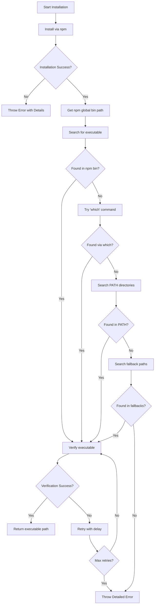

# Nucel CLI Setup Action - Refactoring Plan

## Problem Statement
The GitHub Action fails with "Nucel CLI executable not found after installation" despite npm successfully installing 733 packages. The root cause is that the executable path resolution mechanism (`findNucelExecutable`) searches in hardcoded directories that don't match the actual npm global installation directory used by GitHub Actions runners.

## Root Cause Analysis

### Primary Issue
The `getGlobalNpmPaths` function returns hardcoded paths that don't include the actual npm global bin directory:
- GitHub Actions runners use a specific npm prefix (typically `/opt/hostedtoolcache/node/...`)
- The current implementation doesn't query npm for the actual global bin directory
- No fallback mechanism exists to discover executables using system commands

### Secondary Issues
1. **Deprecated Warnings**: node-domexception warnings appear during installation
2. **Cache Failures**: Cache restoration failures are logged but don't impact functionality
3. **Limited Debugging**: Insufficient logging makes troubleshooting difficult
4. **Error Messages**: Generic error messages don't guide users to solutions

## Solution Architecture

### 1. Dynamic NPM Path Discovery
```typescript
// Primary method: Query npm for actual global bin directory
const getNpmGlobalBinPath = async (): Promise<string> => {
  const { stdout } = await exec.getExecOutput('npm', ['config', 'get', 'prefix'])
  const prefix = stdout.trim()
  return process.platform === 'win32' 
    ? prefix // Windows: npm prefix is the bin directory
    : path.join(prefix, 'bin') // Unix: append /bin
}
```

### 2. Multi-Strategy Executable Discovery
```typescript
const findNucelExecutable = async (): Promise<string | null> => {
  // Strategy 1: Use npm global bin path
  // Strategy 2: Use which/where command
  // Strategy 3: Check common paths
  // Strategy 4: Check PATH environment variable
  // Strategy 5: Look for symlinks in node_modules
}
```

### 3. Enhanced Error Handling
```typescript
interface ExecutableSearchResult {
  found: boolean
  path?: string
  searchedPaths: string[]
  errors: string[]
}
```

## Implementation Workflow



## Key Refactoring Changes

### 1. Enhanced `findNucelExecutable` Function
```typescript
const findNucelExecutable = async (searchPath?: string): Promise<string | null> => {
  const platform = getPlatformInfo()
  const executableName = platform.isWindows ? 'nucel.cmd' : 'nucel'
  
  // Log search initiation
  core.debug(`Searching for Nucel executable: ${executableName}`)
  
  // Strategy 1: Dynamic npm global bin path
  try {
    const npmBinPath = await getNpmGlobalBinPath()
    const nucelPath = path.join(npmBinPath, executableName)
    core.debug(`Checking npm global bin: ${nucelPath}`)
    
    if (await fileExists(nucelPath)) {
      core.info(`Found Nucel CLI at npm global: ${nucelPath}`)
      return nucelPath
    }
  } catch (error) {
    core.warning(`Failed to get npm global bin path: ${error}`)
  }
  
  // Strategy 2: System command (which/where)
  try {
    const systemCommand = platform.isWindows ? 'where' : 'which'
    const { stdout, exitCode } = await exec.getExecOutput(systemCommand, ['nucel'], {
      ignoreReturnCode: true,
      silent: true
    })
    
    if (exitCode === 0) {
      const nucelPath = stdout.trim().split('\n')[0]
      core.info(`Found Nucel CLI via ${systemCommand}: ${nucelPath}`)
      return nucelPath
    }
  } catch (error) {
    core.debug(`System command search failed: ${error}`)
  }
  
  // Strategy 3: PATH environment variable
  const pathDirs = process.env.PATH?.split(path.delimiter) || []
  for (const dir of pathDirs) {
    const nucelPath = path.join(dir, executableName)
    if (await fileExists(nucelPath)) {
      core.info(`Found Nucel CLI in PATH: ${nucelPath}`)
      return nucelPath
    }
  }
  
  // Strategy 4: Fallback to hardcoded paths
  const fallbackPaths = getFallbackPaths(platform)
  for (const dir of fallbackPaths) {
    const nucelPath = path.join(dir, executableName)
    if (await fileExists(nucelPath)) {
      core.info(`Found Nucel CLI in fallback path: ${nucelPath}`)
      return nucelPath
    }
  }
  
  // Log all searched paths for debugging
  core.warning('Nucel CLI executable not found in any of the following locations:')
  core.warning(`- npm global bin: ${await getNpmGlobalBinPath()}`)
  core.warning(`- PATH directories: ${pathDirs.join(', ')}`)
  core.warning(`- Fallback paths: ${fallbackPaths.join(', ')}`)
  
  return null
}
```

### 2. Improved Installation Function
```typescript
const installNucelCLI = async (inputs: Inputs, platform: PlatformInfo): Promise<string> => {
  // ... existing code ...
  
  // Add retry logic for executable discovery
  let nucelPath: string | null = null
  const maxRetries = 3
  const retryDelay = 2000
  
  for (let attempt = 1; attempt <= maxRetries; attempt++) {
    nucelPath = await findNucelExecutable()
    
    if (nucelPath) {
      break
    }
    
    if (attempt < maxRetries) {
      core.warning(`Executable not found (attempt ${attempt}/${maxRetries}). Retrying in ${retryDelay}ms...`)
      await new Promise(resolve => setTimeout(resolve, retryDelay))
    }
  }
  
  if (!nucelPath) {
    // Provide actionable error message
    throw new Error(
      'Nucel CLI executable not found after installation.\n' +
      'Troubleshooting steps:\n' +
      '1. Verify @nucel.cloud/cli was installed successfully\n' +
      '2. Check npm global bin directory: npm config get prefix\n' +
      '3. Ensure the "nucel" command is available in PATH\n' +
      '4. Try running: npm list -g @nucel.cloud/cli\n' +
      '5. For Windows, check if nucel.cmd exists in npm directory'
    )
  }
  
  // ... rest of the function
}
```

### 3. Helper Functions
```typescript
const fileExists = async (filePath: string): Promise<boolean> => {
  try {
    await fs.access(filePath, fs.constants.F_OK | fs.constants.X_OK)
    return true
  } catch {
    return false
  }
}

const getNpmGlobalBinPath = async (): Promise<string> => {
  try {
    const { stdout } = await exec.getExecOutput('npm', ['config', 'get', 'prefix'], {
      silent: true
    })
    const prefix = stdout.trim()
    
    if (process.platform === 'win32') {
      // On Windows, executables are in the npm prefix directory
      return prefix
    } else {
      // On Unix-like systems, executables are in prefix/bin
      return path.join(prefix, 'bin')
    }
  } catch (error) {
    core.warning(`Failed to get npm prefix: ${error}`)
    // Return a sensible default
    return process.platform === 'win32' 
      ? 'C:\\npm' 
      : '/usr/local/bin'
  }
}

const getFallbackPaths = (platform: PlatformInfo): string[] => {
  const paths: string[] = []
  
  if (platform.isWindows) {
    // Windows fallback paths
    if (process.env.APPDATA) {
      paths.push(path.join(process.env.APPDATA, 'npm'))
    }
    if (process.env.LOCALAPPDATA) {
      paths.push(path.join(process.env.LOCALAPPDATA, 'npm'))
    }
    paths.push('C:\\npm', 'C:\\Program Files\\nodejs')
  } else {
    // Unix-like fallback paths
    paths.push(
      '/usr/local/bin',
      '/usr/bin',
      '/opt/homebrew/bin',
      '/home/linuxbrew/.linuxbrew/bin'
    )
    
    if (process.env.HOME) {
      paths.push(
        path.join(process.env.HOME, '.npm-global', 'bin'),
        path.join(process.env.HOME, '.local', 'bin'),
        path.join(process.env.HOME, 'node_modules', '.bin')
      )
    }
    
    // GitHub Actions specific paths
    if (process.env.RUNNER_TOOL_CACHE) {
      paths.push(path.join(process.env.RUNNER_TOOL_CACHE, 'node', '*', '*', 'bin'))
    }
  }
  
  return paths
}
```

### 4. Enhanced Logging
```typescript
const installNucelCLI = async (inputs: Inputs, platform: PlatformInfo): Promise<string> => {
  // Log environment information
  core.info('Environment Information:')
  core.info(`  Platform: ${platform.platform}`)
  core.info(`  Architecture: ${platform.arch}`)
  core.info(`  Node Version: ${process.version}`)
  core.info(`  npm Version: ${await getNpmVersion()}`)
  core.info(`  npm Prefix: ${await getNpmGlobalBinPath()}`)
  core.info(`  PATH: ${process.env.PATH}`)
  
  // ... rest of the function
}
```

## Testing Strategy

### Unit Tests
1. Test each executable discovery strategy independently
2. Mock file system and exec calls
3. Test retry logic with various failure scenarios
4. Verify error messages contain helpful information

### Integration Tests
```yaml
# .github/workflows/test-installation.yaml
- name: Test Nucel CLI Installation
  uses: ./
  with:
    version: 'latest'
    
- name: Verify Installation
  run: |
    which nucel || where nucel
    nucel --version
    
- name: Test with Specific Version
  uses: ./
  with:
    version: '1.0.0'
```

## Migration Path
1. Implement enhanced logging first (non-breaking)
2. Add dynamic npm path discovery (backward compatible)
3. Implement retry logic (improves reliability)
4. Add comprehensive error messages
5. Update documentation with troubleshooting guide

## Success Criteria
- [ ] Action successfully installs Nucel CLI on all platforms (Linux, macOS, Windows)
- [ ] Executable is found using dynamic npm path discovery
- [ ] Meaningful error messages guide users to solutions
- [ ] Retry logic handles transient failures
- [ ] Comprehensive logging aids debugging
- [ ] Tests pass on all supported platforms
- [ ] Documentation includes troubleshooting section

## Risk Mitigation
- **Risk**: Breaking existing workflows
  - **Mitigation**: Keep fallback to original paths, extensive testing
- **Risk**: Performance degradation from multiple search strategies
  - **Mitigation**: Optimize search order, add caching
- **Risk**: Platform-specific issues
  - **Mitigation**: Platform-specific test matrix in CI

## Timeline
1. **Phase 1** (Immediate): Implement dynamic npm path discovery
2. **Phase 2** (Day 1): Add retry logic and enhanced logging
3. **Phase 3** (Day 2): Implement all search strategies
4. **Phase 4** (Day 3): Update tests and documentation
5. **Phase 5** (Day 4): Testing and validation